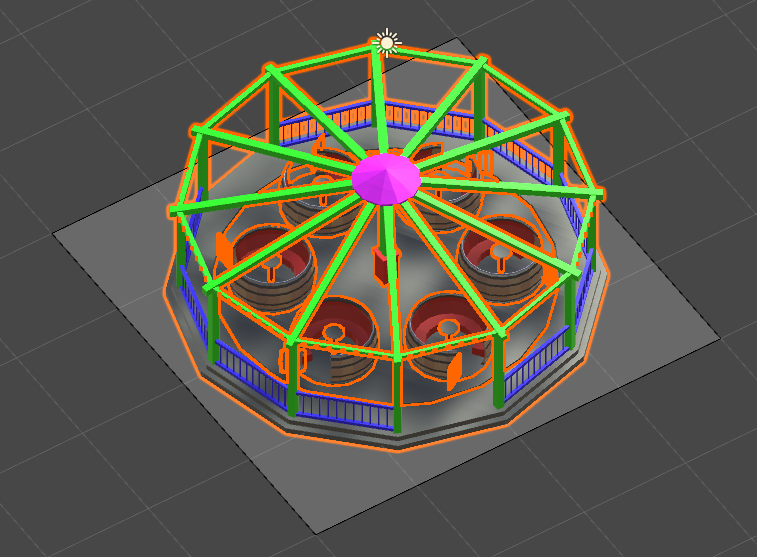
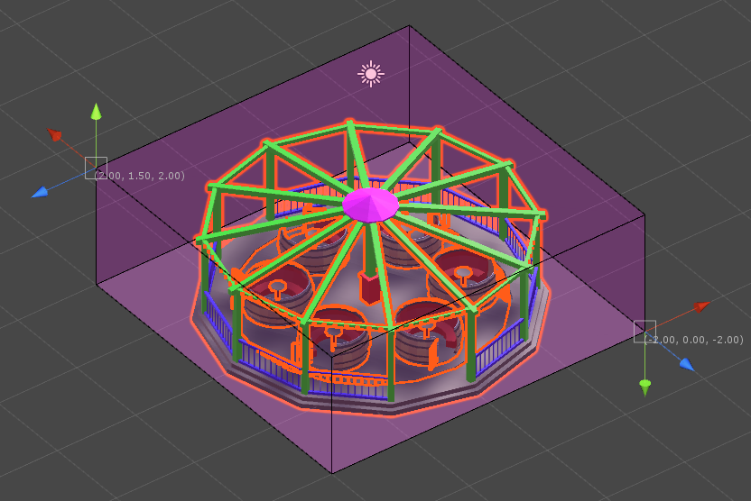
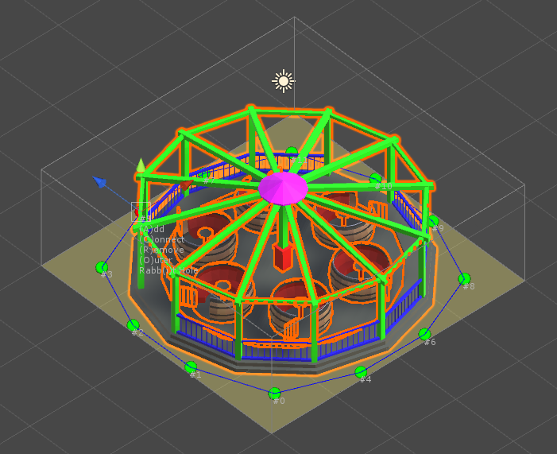
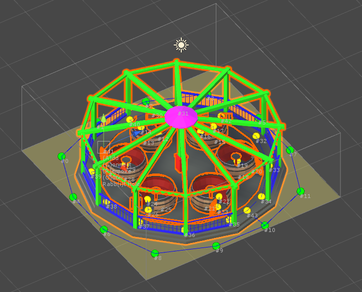
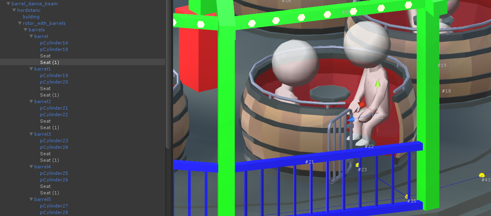
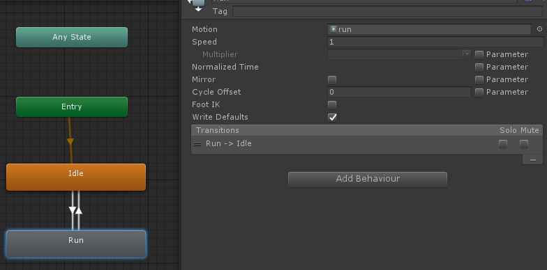
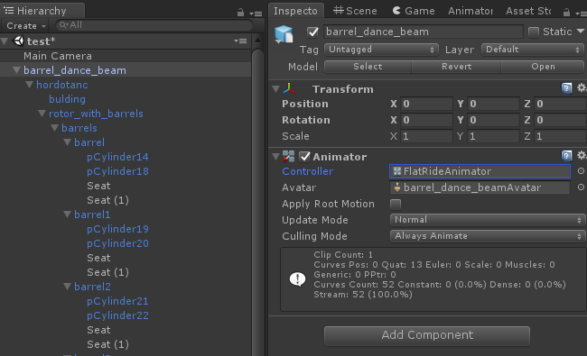

Flat Ride
=========

Rides that run through a certain animation cycle.

Color Settings
--------------

Check [this](Custom-colors) page for more info on custom color settings.

Rating
------

Pick **Excitement**, **Intensity** and **Nausea** values for your ride. They are pretty much arbitrary - check comparable rides that are already part of the game to get an idea for what these values should roughly be.

Ride Footprint
--------------

The size of the rides platform. Make sure it fully encloses the ride while still leaving enough space for guests to walk around it. Keep in mind that the ride entrance and exit can be placed on any tile so guests need to be able to navigate from the entrance to any seat and from any seat to the exit, no matter where the entrance and exit are placed.

Collisions
----------

Add one or more bounding boxes to your ride to define its clearance. No other ride, path or building is allowed to intersect with these bounds.
Hit the "Add bounding box" button, then select the newly created bounding box from the list to edit it. While editing a bounding box you can hold the "S" key to more easily snap it to tile bounds.
Make sure there is at least a 1 unit tall box that fully encloses the ride platform. Add more boxes as needed to block every area the ride touches when going through its animation cycle.

Waypoints
---------

Click the "Enable editing waypoints" button to switch to the waypoints editor. A good start is to then hit the "Generate outer grid" button which creates green waypoints on the outer tiles of the ride platform. Select a waypoint, then press the "C" key to switch to the connection editing mode. Click on adjacent waypoints to create/remove connections. These connections are invisible lines that guests will walk on when navigating your ride.
It should look something like this:

Next, hit the "A" key to create more waypoints near the seats and wherever needed, then connect them to the outer points:

Seats
-----

It's probably easiest to create seat markers in your modeling tool - simply create empty transforms named "Seat". Alternatively you can also add them in Unity.

Animation
---------

Double-click the animation controller located at Assets/Resources/Flat Rides/FlatRideAnimator.controller. Select the "Run" state and assign your animation clip to the "Motion" property. Most of the default rides in the game have an animation duration of around one minute which you should try to match for balance reasons.

Select your ride in the Hierarchy, then in the Inspector assign the FlatRideAnimator to the "Controller" property of the Animator component.

