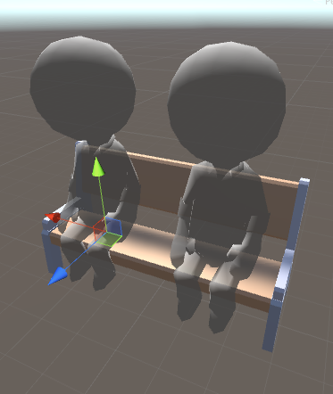

Bench
=====

Benches can be build on the side of paths. They have one or more seats where guests can sit on.

Color settings
--------------

Every object support custom colors. Check [this](Custom-colors) page for more info on custom color settings.

Bench settings
--------------

**Has back rest**: whether guests sitting on this object can put their arm onto the back of the bench. Use the example bench included in the Asset Editor package as guide for the height of the back rest.

Adding Seat
------------

Adding seats works by adding child game objects to the bench. Any game object in the hierarchy whose name starts with "Seat" will be marked as seat. Guests will sit directly on top of this object.

When you've added a seat correctly there will be a rendered guest helper that will show where guests will sit.

