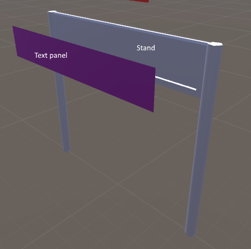
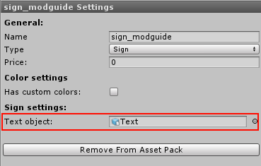

Sign
====

Signs can be placed over or on the side of paths. They can also optionally show texts.

Color Settings
--------------

Every object support custom colors. Check [this](Custom-colors) page for more info on custom color settings.

Sign Settings
-------------

**Text object**: the child game object of the sign that should show the text. Parkitect will replace the material on this object with the text material.

Setup Sign Object
-----------------

Your Sign object should consist of two models. The stand and a child text panel model, see the image below.

The stand can be modeled and mapped normally following the [custom colors](custom-colors) guide. The text panel
requires 1 material named `SignText`. If you name the material correctly, the game will replace the material with the real text shader that shows the scrolling text.

Make sure you've dragged the child text panel game object to the `Text object` setting of the Sign settings.

